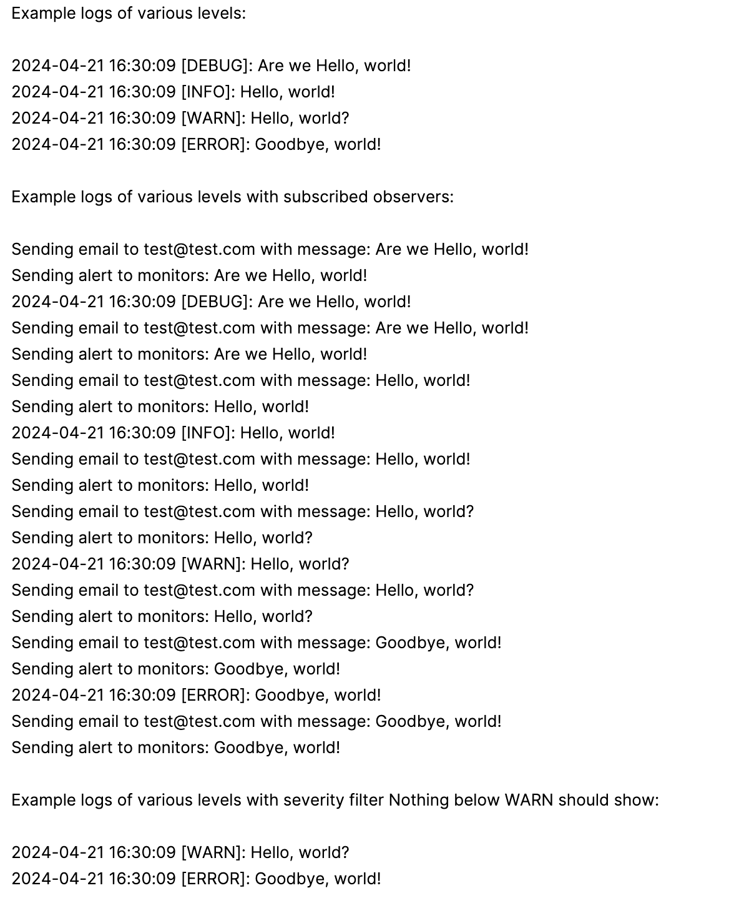

| CS-665       | Software Design & Patterns |
|--------------|----------------------------|
| Name         | Alessandro Allegranzi      |
| Date         | 05/02/2024                 |
| Course       | Spring                     |
| Assignment # | Final Project - MyLogger   |

# MyLoggger Assignment Overview

This is the Final Project for BU MET CS 665. The project is a Java application that demonstrates the use of software design patterns. The new design patterns not covered
in the course that were implemented are Builder, Chain of Responsibility, and Flyweight. The additional design patterns covered in the course are Decorator, Observer, and Singleton.
The MyLogger application is a light-weight logging system that allows logging messages at different severity levels. SFL4J is the industry standard
Java logger, but has shown serious security vulnerabilities in the past. MyLogger is a simple logging system that is easy to implement and use. 

MyLogger allows the user to instantiate concrete loggers that log to files or consoles, and can be added to a chain of responsibility to log messages at different
severity levels. User can log messages at DEBUG, INFO, WARN, and ERROR log levels. 
MyLogger also uses the observer pattern to allow for publishing alerts to emails or monitoring systems in case of severe logged errors.
Additionally, the use of decorators allows for filtering of log messages based on severity level.

Please see sample logged output below:



[Link to presentation Slides](https://docs.google.com/presentation/d/1OQGGIyOVIdrh-q4DaSFKUvBwVfO_PUpWuPcB0DEQxr4/edit?usp=sharing)

## The new design patterns implemented are:

[Builder (C)](https://refactoring.guru/design-patterns/builder)

[Chain of Responsibility (B)](https://refactoring.guru/design-patterns/chain-of-responsibility)

[Flyweight (S)](https://refactoring.guru/design-patterns/flyweight)


## Additional design patterns covered in course are:

[Decorator (S)](https://refactoring.guru/design-patterns/decorator)

[Observer (B)](https://refactoring.guru/design-patterns/observer)

[Singleton (C)](https://refactoring.guru/design-patterns/singleton)

# GitHub Repository Link:
https://github.com/1-8192/MyLogger

# Implementation Description 

## UML Diagram for MyLogger


## Description

For each assignment, please answer the following:

 ### Explain the level of flexibility in your implementation, including how new object types can be easily added or removed in the future.

MyLogger demonstrates a high level of flexibility through its use of design patterns such as the Chain of Responsibility, Observer, and Decorator. The Chain of Responsibility pattern allows for the easy addition or removal of loggers in the chain. 
This is achieved by maintaining a chain of logger objects and allowing each logger to either handle the request or pass it along to the next logger in the chain. This design allows for the easy addition of new types of loggers or the removal 
of existing ones without affecting the rest of the chain. Concrete Loggers implement the [Logger interface](src/main/java/edu/bu/met/cs665/Logger.java), which makes it simple and direct to add new types of loggers without breaking method contracts with the application.

The Observer pattern provides flexibility in the way alerts are handled. By allowing loggers to have observers, different types of alert handlers can be added or removed as needed. 
For instance, an EmailAlertObserver or an AlertingMonitorObserver can be attached to a logger to handle alerts. If in the future a new type of alert handler is needed, a new observer can be created by implementing the [Observer inerface](src/main/java/edu/bu/met/cs665/Observer.java) and attached to the logger. Similarly, existing 
observers can be detached if they are no longer needed. 

The Decorator pattern is used to add additional functionality such as severity filtering to a logger dynamically, providing another layer of flexibility. The [LoggerDecorator](src/main/java/edu/bu/met/cs665/LoggerDecorator.java) abstract class provides a template for 
decorators to extend. This makes the system highly adaptable to changing requirements and promotes code reusability and maintainability.

### Discuss the simplicity and understandability of your implementation, ensuring that it is easy for others to read and maintain.

The simplicity and understandability of the MyLogger implementation are ensured through the use of well-known design patterns, clear class and method names, and comprehensive comments. The use of design patterns such as Chain of Responsibility, 
Observer, Decorator, and Singleton makes the code structure familiar to other developers, making it easier to understand how the different components of the system interact.

Each class and method in the system has a clear and descriptive name that indicates its purpose. For example, the `LoggerChain` class represents a chain of loggers, and the `addLogger` method in this class is used to add a logger to the chain. 
This makes the code self-explanatory, reducing the need for additional documentation. The application defines several interfaces and abstract classes that make behavior clear and easily
extendable. 

The code is also thoroughly commented, with each class and method having a comment that describes its purpose and functionality. This makes it easier for other developers to understand what each part of the code is doing, making the code easier to maintain and modify.

The use of the Builder pattern for creating logger instances also contributes to the simplicity and understandability of the code. This pattern allows for the creation of complex logger objects in a step-by-step manner, making the code more readable and easier to understand.

Finally, the code is organized in a logical and consistent manner, with each class being in its own file and related classes being in the same package. This makes it easier to navigate the codebase and find the relevant parts of the code when making changes or additions.

### Describe how you have avoided duplicated code and why it is important.

In the MyLogger application, duplicated code has been avoided through the use of design patterns and object-oriented programming principles. The Chain of Responsibility pattern, for instance, allows us to avoid duplicating the logic of passing 
log messages along the chain of loggers. Each logger in the chain only needs to know about the next logger in the chain, and the logic for passing messages along the chain is encapsulated in the Logger interface and its implementations.

The Observer pattern is used to avoid duplicating the logic of alerting observers when a log message is received. Each Logger can have multiple observers, and the logic for notifying these observers is encapsulated in the Logger class.

The Singleton pattern is used in the LoggingSimulation class to ensure that there is only one instance of the logging simulation, avoiding the need to duplicate the creation and initialization code for the simulation.

The use of the Builder pattern in creating Logger instances helps to avoid duplicating code for creating complex Logger objects. The builder encapsulates the construction logic, allowing Logger objects to be created in a flexible and controlled manner.

### If applicable, mention any design patterns you have used and explain why they were chosen.

The MyLogger application implements several design patterns to achieve its functionality:

1. **Builder Pattern**: The Builder pattern is used in the creation of Logger instances. This pattern is chosen because it provides a flexible and readable way to create complex objects. In the case of Logger instances, there are several parameters that can be set, 
such as the date-time format and file name for FileLogger. Using the Builder pattern, these parameters can be set in a clear and flexible way, making the code easier to read and maintain. Rather than abstracting Builders using an interface and implementing concrete builders, 
the Builder pattern was implemented as a nested inner class to keep the codebase simple and easy to understand. Each Concrete Logger class has its own nested builder, adding to design clarity.

2. **Chain of Responsibility Pattern**: The Chain of Responsibility pattern is used to manage a chain of Logger objects. This pattern is chosen because it allows the application to pass log messages along a chain of Logger objects, each of which can decide whether to handle the message or pass it along to the next Logger in the chain. 
A user might want to log to console, to an output file, and to external monitors, so the chain removes duplicate code needed to explicitly log to all concrete loggers. This design provides flexibility in handling log messages and makes it easy to add or remove Logger objects from the chain.

3. **Singleton Pattern**: The Singleton pattern is used in the LoggingSimulation class to ensure that there is only one instance of the logging simulation. This pattern is chosen because it ensures that the logging simulation, which manages the Logger chain and runs the logging examples, is only instantiated once.
This avoids potential issues with multiple instances of the logging simulation running concurrently.

4. **Flyweight Pattern**: The Flyweight pattern was implemented in the MyLogger application to optimize memory usage by sharing Log objects for the same log level. This is particularly beneficial in a logging system where many log messages of the same level are generated. The LogFlyweightFactory class manages the creation of Log 
objects and maintains a Map where the keys are the log levels and the values are the Log objects. When a Log object for a given level is requested, the factory checks if it already exists in the Map. If it does, it returns that object. If it doesn't, it creates a new Log object, puts it in the Map, and returns it. This approach ensures 
that only one Log object is created for each log level, significantly reducing memory usage when logging multiple messages of the same level. Log instances are not very memory intense and the use of the Flyweight pattern is a little forced here, but I really wanted to hit a third new pattern so just went for it. Can't hurt 
to share some resources even in lightweight objects. 

5. **Decorator Pattern**: The Decorator pattern is used to add additional functionality to a Logger dynamically. In the case of the SeverityFilterLogger, this pattern is used to add severity filtering functionality to an existing Logger. This pattern is chosen because it allows for the addition of new 
functionality without modifying the existing Logger classes, promoting code reusability and maintainability.

6. **Observer Pattern**: The Observer pattern is used to allow Logger objects to notify observers when a log message is received. This pattern is chosen because it provides a flexible way to handle alerts. By allowing Logger objects to have observers, different types of alert handlers, such as EmailAlertObserver and AlertingMonitorObserver, can be added or removed as needed. 
This makes the system highly adaptable to changing requirements and allows log activity to be published to external systems, which is a common requirement in enterprise applications.


# Maven Commands

We'll use Apache Maven to compile and run this project. You'll need to install Apache Maven (https://maven.apache.org/) on your system. 

Apache Maven is a build automation tool and a project management tool for Java-based projects. Maven provides a standardized way to build, package, and deploy Java applications.

Maven uses a Project Object Model (POM) file to manage the build process and its dependencies. The POM file contains information about the project, such as its dependencies, the build configuration, and the plugins used for building and packaging the project.

Maven provides a centralized repository for storing and accessing dependencies, which makes it easier to manage the dependencies of a project. It also provides a standardized way to build and deploy projects, which helps to ensure that builds are consistent and repeatable.

Maven also integrates with other development tools, such as IDEs and continuous integration systems, making it easier to use as part of a development workflow.

Maven provides a large number of plugins for various tasks, such as compiling code, running tests, generating reports, and creating JAR files. This makes it a versatile tool that can be used for many different types of Java projects.

## Compile
Type on the command line: 

```bash
mvn clean compile
```


## JUnit Tests
JUnit is a popular testing framework for Java. JUnit tests are automated tests that are written to verify that the behavior of a piece of code is as expected.

In JUnit, tests are written as methods within a test class. Each test method tests a specific aspect of the code and is annotated with the @Test annotation. JUnit provides a range of assertions that can be used to verify the behavior of the code being tested.

JUnit tests are executed automatically and the results of the tests are reported. This allows developers to quickly and easily check if their code is working as expected, and make any necessary changes to fix any issues that are found.

The use of JUnit tests is an important part of Test-Driven Development (TDD), where tests are written before the code they are testing is written. This helps to ensure that the code is written in a way that is easily testable and that all required functionality is covered by tests.

JUnit tests can be run as part of a continuous integration pipeline, where tests are automatically run every time changes are made to the code. This helps to catch any issues as soon as they are introduced, reducing the need for manual testing and making it easier to ensure that the code is always in a releasable state.

To run, use the following command:
```bash
mvn clean test
```


## Spotbugs 

SpotBugs is a static code analysis tool for Java that detects potential bugs in your code. It is an open-source tool that can be used as a standalone application or integrated into development tools such as Eclipse, IntelliJ, and Gradle.

SpotBugs performs an analysis of the bytecode generated from your Java source code and reports on any potential problems or issues that it finds. This includes things like null pointer exceptions, resource leaks, misused collections, and other common bugs.

The tool uses data flow analysis to examine the behavior of the code and detect issues that might not be immediately obvious from just reading the source code. SpotBugs is able to identify a wide range of issues and can be customized to meet the needs of your specific project.

Using SpotBugs can help to improve the quality and reliability of your code by catching potential bugs early in the development process. This can save time and effort in the long run by reducing the need for debugging and fixing issues later in the development cycle. SpotBugs can also help to ensure that your code is secure by identifying potential security vulnerabilities.

Use the following command:

```bash
mvn spotbugs:gui 
```

For more info see 
https://spotbugs.readthedocs.io/en/latest/maven.html

SpotBugs https://spotbugs.github.io/ is the spiritual successor of FindBugs.


## Checkstyle 

Checkstyle is a development tool for checking Java source code against a set of coding standards. It is an open-source tool that can be integrated into various integrated development environments (IDEs), such as Eclipse and IntelliJ, as well as build tools like Maven and Gradle.

Checkstyle performs static code analysis, which means it examines the source code without executing it, and reports on any issues or violations of the coding standards defined in its configuration. This includes issues like code style, code indentation, naming conventions, code structure, and many others.

By using Checkstyle, developers can ensure that their code adheres to a consistent style and follows best practices, making it easier for other developers to read and maintain. It can also help to identify potential issues before the code is actually run, reducing the risk of runtime errors or unexpected behavior.

Checkstyle is highly configurable and can be customized to fit the needs of your team or organization. It supports a wide range of coding standards and can be integrated with other tools, such as code coverage and automated testing tools, to create a comprehensive and automated software development process.

The following command will generate a report in HTML format that you can open in a web browser. 

```bash
mvn checkstyle:checkstyle
```

The HTML page will be found at the following location:
`target/site/checkstyle.html`

## Running the Application

### From an IDE

Open the Main.java class file, and using your IDE UI run the class. In IntelliJ there is a "play" button.


